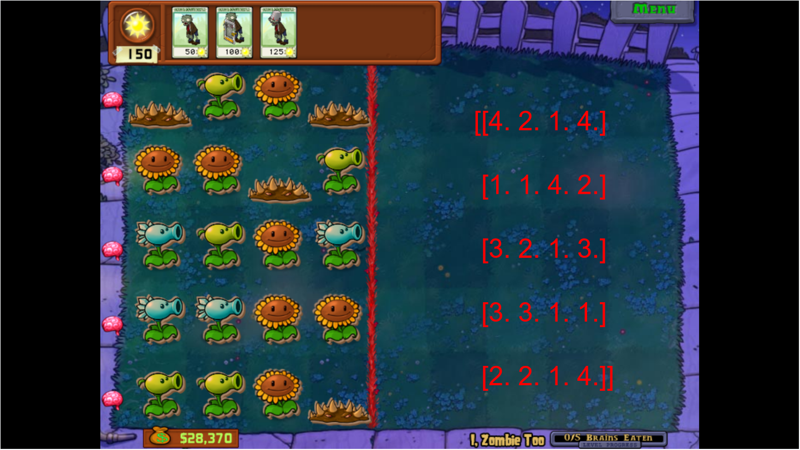

### stage_1 通过检测像素的方式测试训练一个简单的强化学习 AI，目的是实现“我是僵尸”模式的无尽
---

之所以从 **我是僵尸** 模式较简单的关卡入手，是因为：

1. **僵尸不会自然刷新**，不用检测僵尸的每波刷新的类别与数量。
2. **植物不会左右摇摆且种类确定**，可以进行指定点像素检测。
3. 简单关卡阵型**不存在特定植物**，比如玉米投手这种输出难以预测的。

先从最简单的关卡中选择一个，只要知道会刷新的植物类别，通过指定像素值分类的方法，我们可以稳定将阵型截图转化为矩阵的形式：

